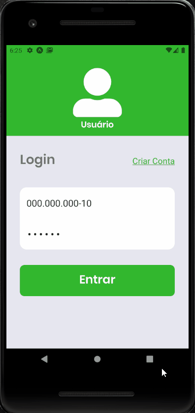
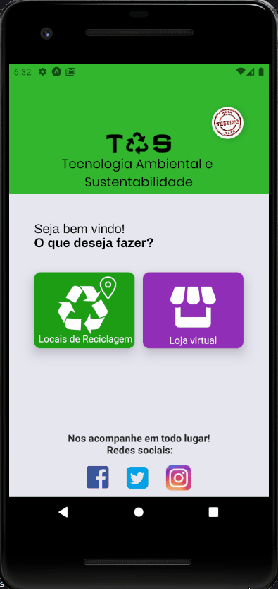
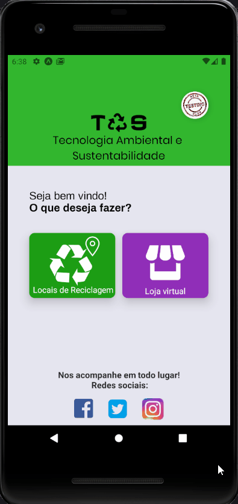
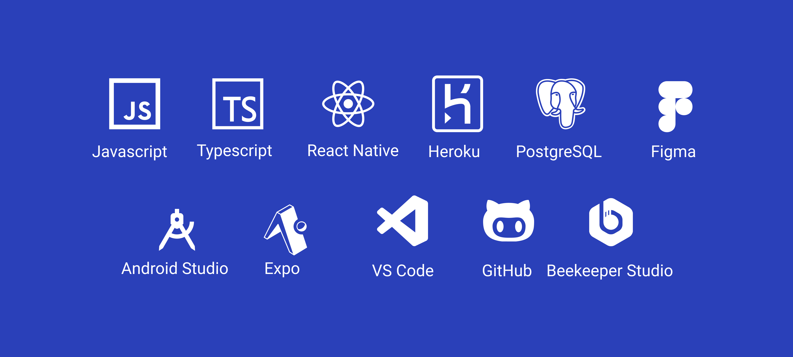

<h1 align="center">Bem vindo ao Coleta amiga!👋</h1>

<h2>Projeto de acessibilidade a reciclagem, encontre locais de reciclagem onde você quiser!</h2>
 
<h3>Exemplo de navegação de Usuário:</h3>

 
<table>
  <tr>
    <th><strong>Tela inicial, Sobre nós e Login:</strong></th>
    <th><strong>Criar Conta:</strong></th>
    <th><strong>Criar Perfil:</strong></th>
  </tr>
  <tr>
    <td> 
      
    </td>
    <td> 
      
    </td>
    <td> 
      
    </td>
  <tr>
    <th><strong>Visualizar no Maps:</strong></th>
    <th><strong>Criar Cupom:</strong></th>
  </tr>
  <tr>
    <td> 
      
    </td>
    <td> 
      
    </td>
  <tr>
</table>
  

<h3>
  <strong>Formas de usar</strong>
</h3>

>1. Baixe o arquivo apk abaixo e instale no seu android
### ✨ https://expo.io/artifacts/049abbbe-7279-451b-8be4-ce145c40faf9
 

>2. Use o aplicativo Expo no seu celular ou emulador para testar o projeto, basta acessar o link abaixo, escanear o QR code com o aplicativo Expo(Apenas Android) ou inserir seu E-mail no campo 'Request a link', onde será enviado um link que dará acesso ao projeto através do Expo
### ✨ (https://expo.io/@erthaldeveloper/projects/TAS-mobile)
 

<h3>
  <strong>Ferramentas e tecnologias usadas</strong>
</h3>

## Author

👤 **Lucas Erthal**

* Github: [@LucasErthal](https://github.com/LucasErthal)
* LinkedIn: [@Lucas de Oliveira Mattos Erthal](https://www.linkedin.com/in/lucas-de-oliveira-mattos-erthal-aa580517b/)

## Show your support

Give a ⭐️ if you liked this project!

***
Direitos de marca reservados: Magnun Bernardo Albuquerque de Medeiros, Matheus Sales Quadros

_This README was generated with ❤️ by [readme-md-generator](https://github.com/kefranabg/readme-md-generator)_

